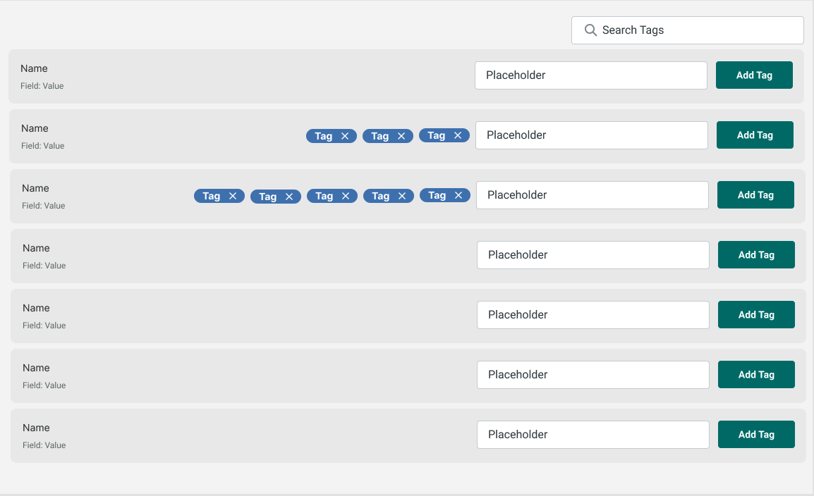

# Sedna
## Technical Assignment

### Introduction

- Create an app that allows a user to save tags for items in a single page list. 
- An item can have a maximum of 5 tags and should be removable, but not editable. 
- Each item in the list should display at least the name of the item and date. 
- Tags should be persisted so that the tags remain across browser sessions. 
- The list should also be filterable by user defined tags through a simple search. 
- You must create the UI components yourself and avoid usage of third party libraries such as Material UI or Reactstrap, however you may use any additional open source libraries you need. 
- You may use any icon set you wish to use. 
- Please style your solution to match the attached screenshot.


- We’ve created a mock endpoint that returns a list of 200 results. 
- Please use the following endpoint for your data: https://my.api.mockaroo.com/movies.json?key=bf3c1c60


- We expect candidates to spend around 3 hours on this. 
- Please share your solution in a GitHub repo and invite [engineering@sedna.com](mailto:engineering@sedna.com) and [devops@sedna.com](mailto:devops@sedna.com) and let us know once you have submitted the assignment.

**Mockup:**




### Solution

This project was bootstrapped with [Create React App](https://github.com/facebook/create-react-app):

```
npx create-creact-app sedna --template=typescript
```

Promise based HTTP client for the browser and node.js:

```
yarn add axios
```

Font Awesome icons for [React](https://fontawesome.com/v5.15/how-to-use/on-the-web/using-with/react):

```
yarn add @fortawesome/fontawesome-svg-core
yarn add @fortawesome/free-solid-svg-icons
yarn add @fortawesome/react-fontawesome
```

Adding a [Sass](https://create-react-app.dev/docs/adding-a-sass-stylesheet/) stylesheets:

```
yarn add node-sass
```

### Available Scripts

In the project directory, you can run:

```
yarn start
```

Runs the app in the development mode.\
Open [http://localhost:3000](http://localhost:3000) to view it in the browser.

The page will reload if you make edits.\
You will also see any lint errors in the console.

```
yarn test
```

Launches the test runner in the interactive watch mode.\
See the section about [running tests](https://facebook.github.io/create-react-app/docs/running-tests) for more information.

```
yarn build
```

Builds the app for production to the `build` folder.\
It correctly bundles React in production mode and optimizes the build for the best performance.

The build is minified and the filenames include the hashes.\
Your app is ready to be deployed!

See the section about [deployment](https://facebook.github.io/create-react-app/docs/deployment) for more information.

```
yarn eject
```

**Note: this is a one-way operation. Once you `eject`, you can’t go back!**

If you aren’t satisfied with the build tool and configuration choices, you can `eject` at any time. This command will remove the single build dependency from your project.

Instead, it will copy all the configuration files and the transitive dependencies (webpack, Babel, ESLint, etc) right into your project so you have full control over them. All of the commands except `eject` will still work, but they will point to the copied scripts so you can tweak them. At this point you’re on your own.

You don’t have to ever use `eject`. The curated feature set is suitable for small and middle deployments, and you shouldn’t feel obligated to use this feature. However we understand that this tool wouldn’t be useful if you couldn’t customize it when you are ready for it.

